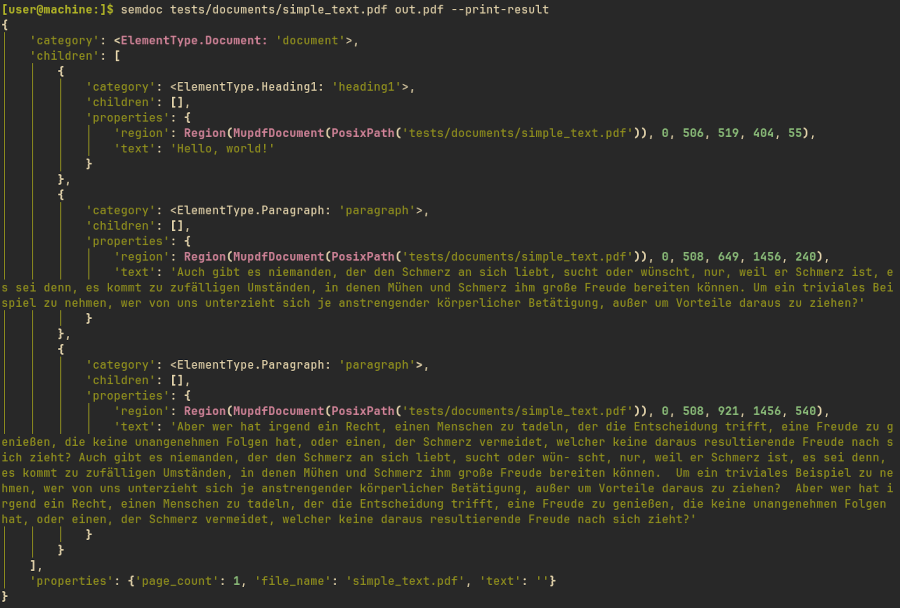

# <div align="center">SemanticDocuments</div>

> **<div align="center">[is going to be] a document understanding tool that creates accessible PDF files </div>**

SemanticDocuments analyses the meaning of documents and creates accessible PDF files. It handles digital PDFs and scanned bitmap documents. It uses document understanding models and Open Source libraries to extract the content and its semantic structure from letters, invoices and forms. It produces accessible PDF files that adhere to the PDF/UA standard.

> **Note**
> This project is heavily work-in-progress. Some parts work fine, but overall it is not ready to be used.

## Usage

```
[user@machine:]$ semdoc --help

 Usage: semdoc [OPTIONS] INPUT OUTPUT

╭─ Arguments ─────────────────────────────────────────────────────────────────────────╮
│ *    input       FILE  Input document [default: None] [required]                    │
│ *    output      FILE  Output document [default: None] [required]                   │
╰─────────────────────────────────────────────────────────────────────────────────────╯
╭─ Options ───────────────────────────────────────────────────────────────────────────╮
│ --print-result        --no-print-result          Pretty print the semantic tree of  │
│                                                  the document                       │
│                                                  [default: no-print-result]         │
│ --visualize-result    --no-visualize-result      Show the document annotated with   │
│                                                  detected boxes                     │
│                                                  [default: no-visualize-result]     │
│ --help                                           Show this message and exit.        │
╰─────────────────────────────────────────────────────────────────────────────────────╯
```

## Example

This project is under heavy development. This screenshot shows some output it produced at some time to hopefully illustrate the general idea. The actual behavior of the tool might already have changed.



## Features and Roadmap

- Recognition of:
  - Textual content with semantic structure and markup
  - Tables
  - Forms
  - Lists
  - Header blocks / metadata sections in letters
  - Multiple columns
  - Reading order
- Output formats
  - PDF/UA (ISO 14289)
  - XML / json
  - Preserve location information
  - Preserve confidence information
- Processing steps
  - Undo line breaks, convert hyphens to soft hyphens
  - Predict alternative texts for images
- Modular pipelines for different use cases and document types
  - Easy to extend with new functionality
  - Recognition models can be swapped or tailored to use case
- Select different recognition models depending on available resources

## License

SemanticDocuments is published under the GNU General Public License v3. If you intent to use this project and have specific licensing requirements, please contact [us](mailto:info@infiniteaccess.eu).

## Acknowledgments

- Funded from March 2024 until September 2024 by
  <br>
  
